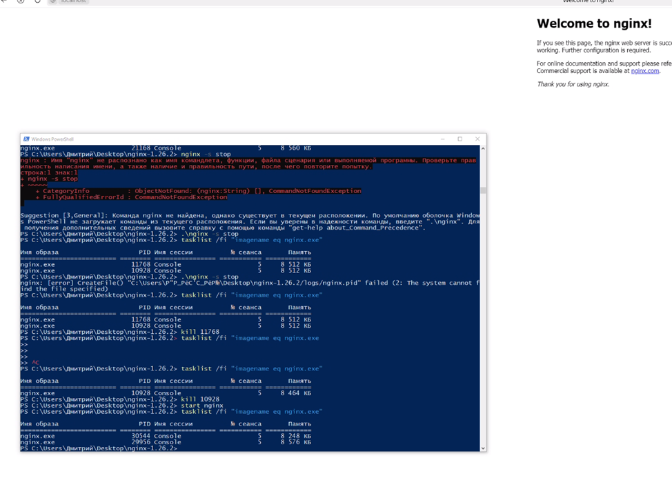
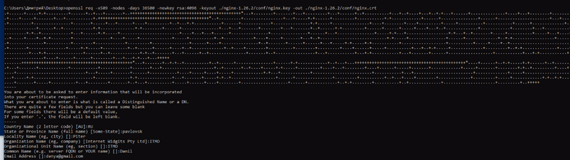
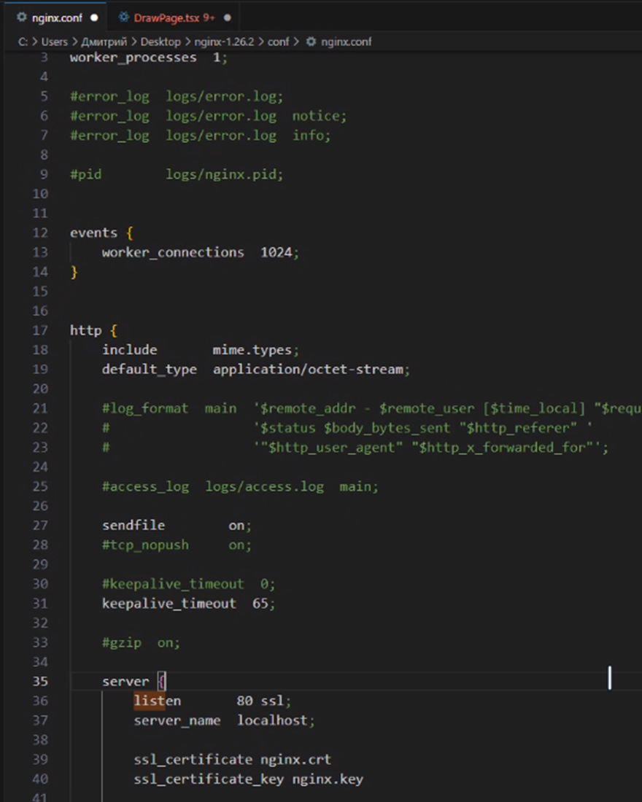
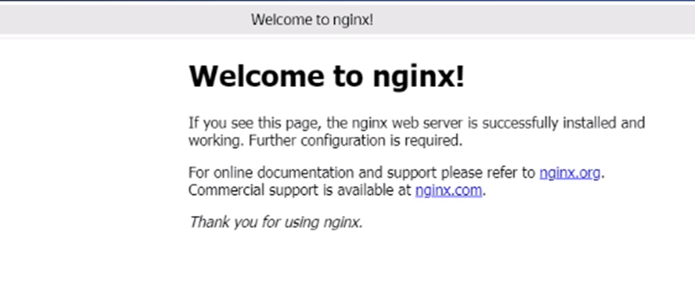
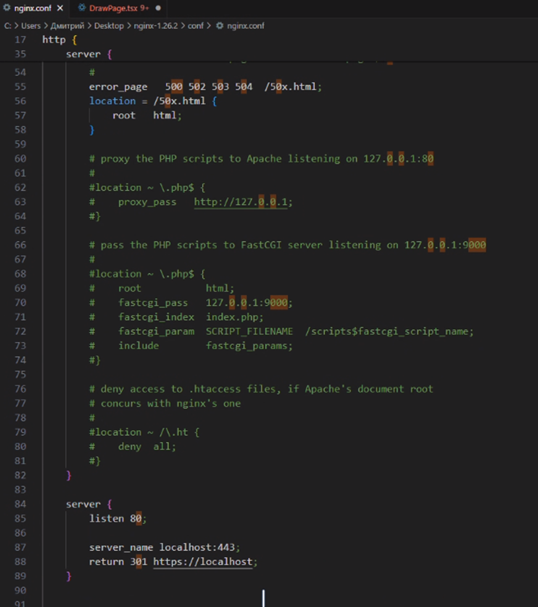
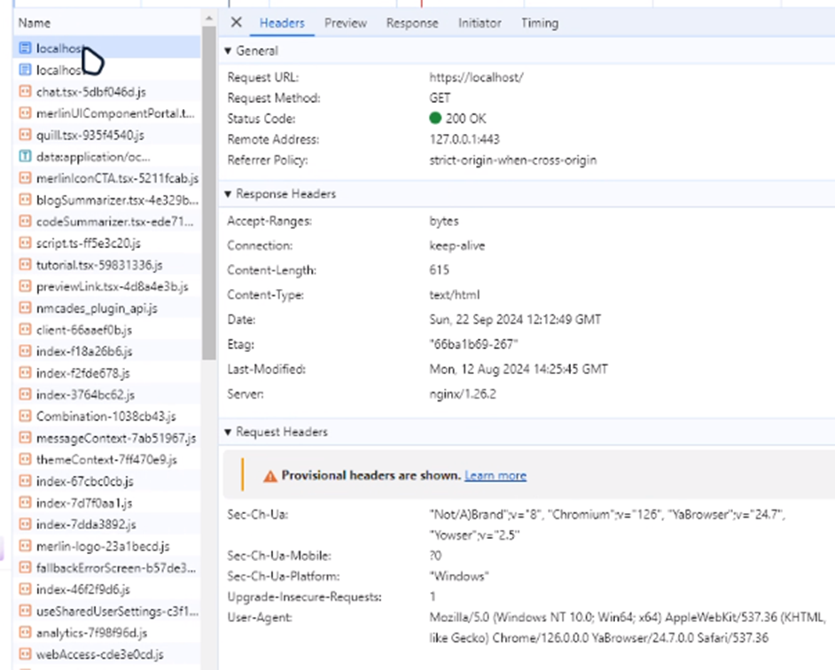
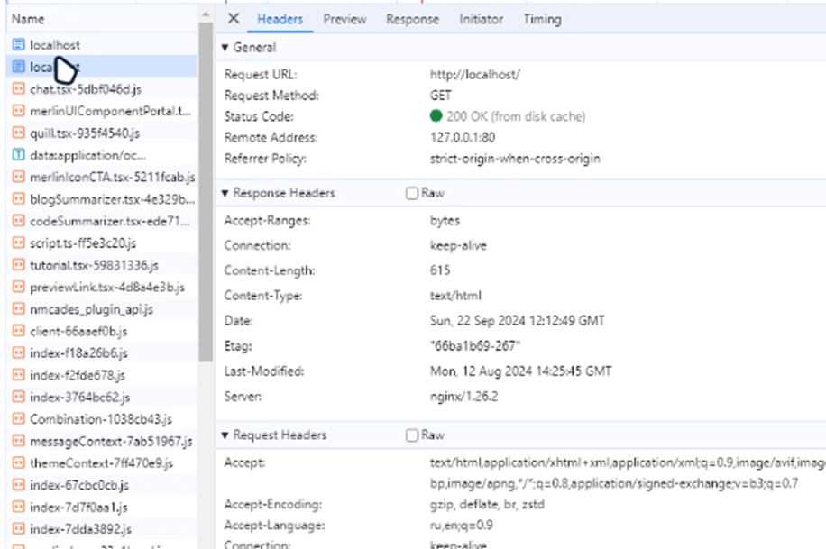
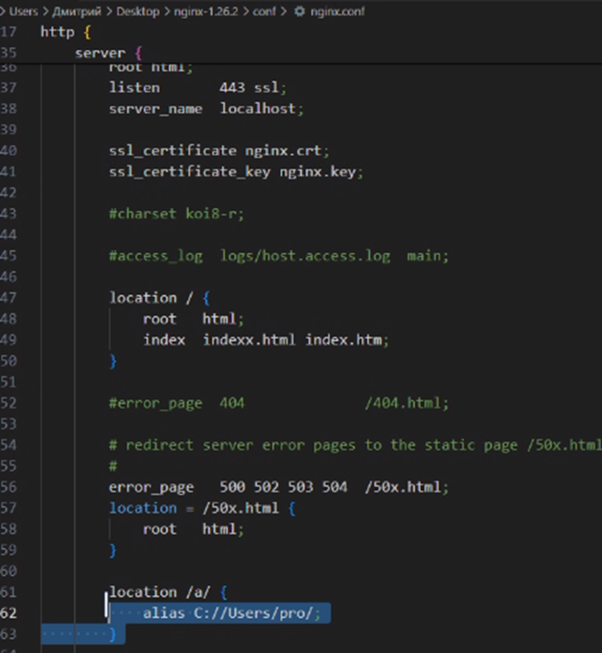
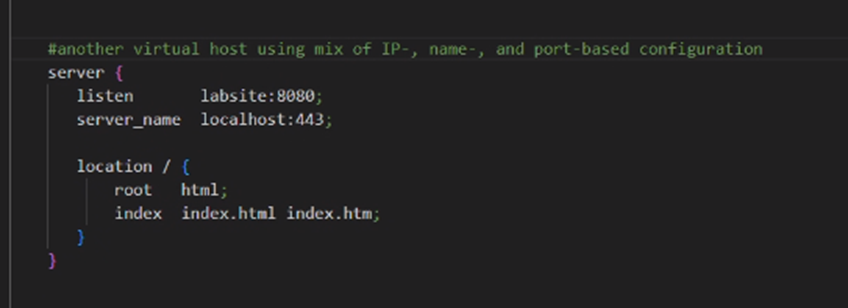
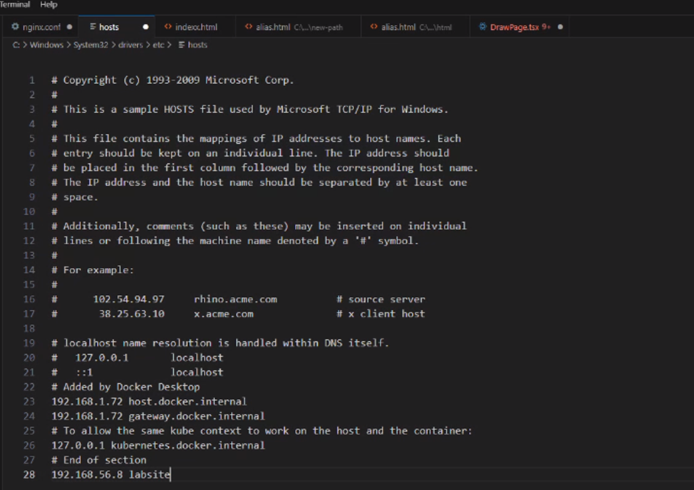

# LAB1
## Nginx

### Цель 
Целью лабораторной работы является запуск и настройка nginx сервера, в связи с чем начнем с установки и проверки работы непосредственно сервиса nginx.

### Установка
Для начала установим nginx на Windows с помощью официального гайда – скачиваем дистрибутив, распаковываем его, переходим в распакованную папку и выполняем в powershell start nginx
Для проверки работоспособности сервера проверям запущенные процессы выполнив tasklist /fi "imagename eq nginx.exe" 
После этого переходим в браузере на старницу localhost и видим приветствующую нас стартовую страницу nginx, являющейся html файлом index.html из папки рабочей директории html.



### Настройка HTTPS

Далее, нам необходимо настроить сертификаты, для того чтобы наш сервер работал по https. Для этого генерируем сертификат c помощью команды
```
openssl
```
приложенной на скриншоте.



После этого меняем конфиг nginx'a, добавив в блок server поля ssl_certificate и ssl_sertificate_key и выставив им значения соответсвующие названиям сгенерированных файлов, а так же добавив ssl к полю listen.



Пробуем присоединиться к серверу по https. Сервер отвечает, однако браузер сообщает нам о том что подключение все равно небезопасное.




Для того чтобы соединение было безопасным, настроим принудительное перенаправление с порта 80 на порт 443, изменив конфигурацию nginx, добавили еще один блок server, как представлено на скриншоте ниже. 



Протестируем наши запросы с помощью postman. Как видно на скриншотах, наш http запрос успешно редайректится, а https запрос возвращает OK. Удар!





### Алиасы

Теперь настроим алиасы, изменив конфигурацию nginx. Сделаем так чтобы по url localhost/a/ отображалась другая страница, добавив в конфиг объект location, как представлено на скриншоте.



### Виртуальные хосты

Добавим виртуальные хосты, чтобы наш сервер обслуживал несколько доменных имен. В нашем случае сделаем достаточную реализацию, чтобы наша дефолтная index страница nginx работала по другому имени.
Для этого добавим еще один блок server в конфиг файл nginx'a как представлено на скриншоте.



И добавим в файл разрешения доменных имен hosts запись о нашем имени labsite для того, чтобы в браузере можно было перейти не по айпи, а по имени домена.

