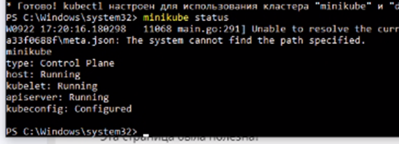
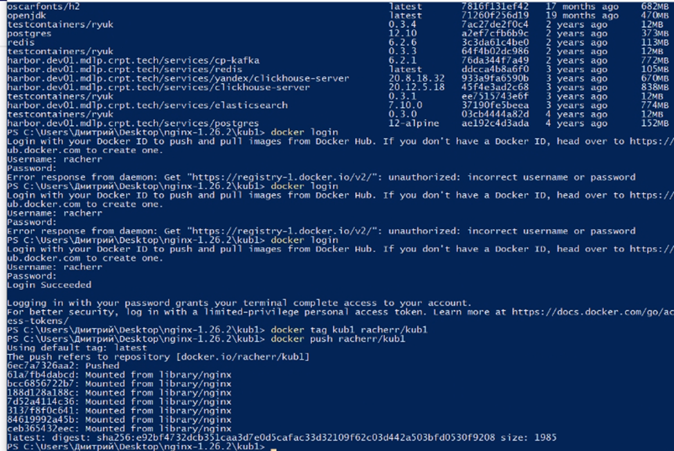
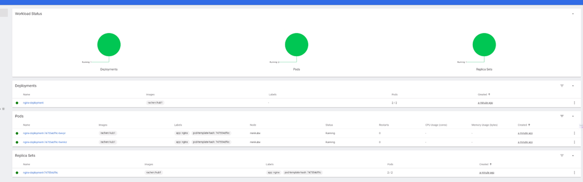
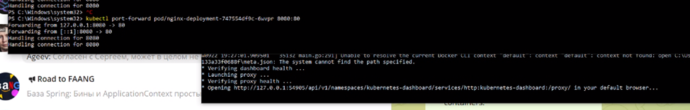

# LAB3
## Kubernetes

### Установка и настройка
Проведем первоначальную настройка кластера кубера, в нашем случае minicube. Проверим установку с помощью команды minicube status.



Закидываем наш проект на докерхаб для получения возможности развернуть его на кубере через докерхаб.



### YAML файл развертывания 
Теперь напишем yaml файл, с помощью которого будем разворачивать наш кластер кубера. Для этого указываем докер image который мы запушили, а также сразу укажем 80 порт как порт контейнера.

```yaml
apiVersion: apps/v1
kind: Deployment
metadata:
  name: nginx-deployment
spec:
  selector:
    matchLabels:
      app: nginx
  replicas: 2 
  template:
    metadata:
      labels:
        app: nginx
    spec:
      containers:
      - name: nginx
        image: racherr/kub1
        ports:
        - containerPort: 80
```

Выполняем развертывание с помощью 
```
kubectl
```
и открываем дешборд, чтобы убедиться что наши поды работают в штатном режиме.



### Работоспособность

Проверим практическую работоспособность сервиса. У нас уже стоит на нем nginx, однако чтобы увидеть нашу заветную index.html на хост машине выполним проброс портов с помощью команды 
```
kubectl port-forward
```
, как на скриншоте.



Открываем локалхост с нашим проброшенным портом и видим заветную страницу с сервера, запущенного в поде кубера.

